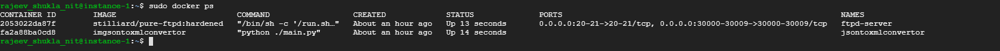

## Task

Write a python script, which will convert json files to xml files and transfers it in a remote location.

**Environment:** Python, Docker

**Description:**

Solution should be prepared as two Docker images, 1st to send files, and 2nd to receive them.

Deployment of these containers should be automated using docker-compose or shell script.

Python script on container A:

    1. convert all json files to xml

    2. Transfer it to a remote location (container B)

Python script on container B:

    1. Receive files

    2. Store files

So, in other words, pipeline should look like:

Json -> XML -> transfer -> XML

**Acceptance criteria**:

Any given Json putted to container A appears in XML form on container B using mentioned pipeline.

## Solution:

#### 1. Algorithm:
**Create a python script which performs below functionalities:**
 >    i. Monitor the source directory for any .json file in small intervals.

                        if (.json file found)
                        - converts to xml
                        - append time stamp to xml and save it to target directory
                        - append timestamp to input json file and archive it

>   ii. Monitor the target directory for any .xml file in small intervals.

                        if (.xml file found) 
                        - ftp it to container B(ftp server), under a folder based on current date
                        - append timestamp to the xml file and archive it

#### 2. Architecture:

>       Create Docker file to build image for container A, with Entry point as the python script from step 1 above.

 >       Create a Docker compose file, having 2 services. One for the python script to run in Container A and other to receive the file from container A.

	

#### 3. Environment** 

**OS**: 

 **Python**:

**Docker**:

**Pip package required**:

#### 4. Folder structure:**

#### 5. Steps:** 

    1. Run 
`sudo docker-compose up –d`
    
    2. Check the containers deployed and running

    3. Copy json files under ./testdata to /home/src of jsontoxmlconvertor

`sudo docker cp testdata/. jsontoxmlconvertor:/home/src`

    4. Xml file created and stored under the current Date folder in ftpd-server

    5. Check jsontoxml.log in jsontoxmlconvertor container

    6. Check the src and target archived file

